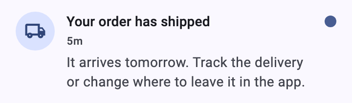
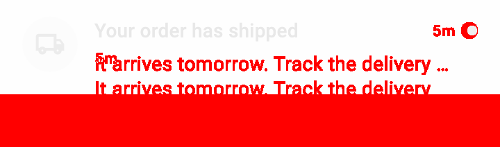
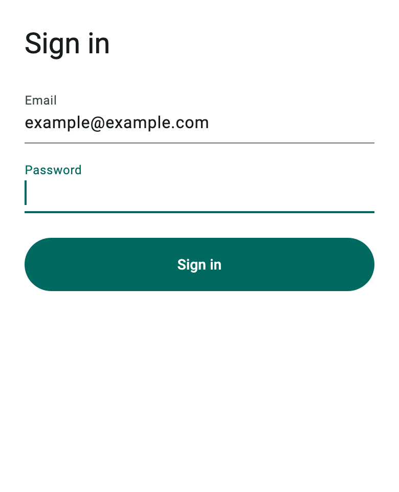
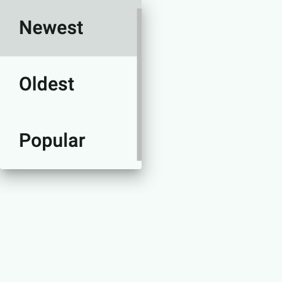

*This post describes shutter v0.2.0.*

A pull request that changes how something looks is hard to review from the diff alone. `padding: 24` became `padding: 40`. What does that mean on screen? Which screens does it touch? Did anything overflow?

The honest answer is always the same: you have to look. And “looking” in Flutter usually means building the app, starting a simulator, navigating to the right screen, and taking a screenshot. Then you do it all again after the change, at the same scroll position, on the same device, in the same state.

This has become more pressing, not less, now that coding agents write a growing share of UI code. An agent can edit a widget, run the analyzer, and pass the tests on its own. Checking what the result looks like is the step that still slows the loop down. A UI change is easier to review when it arrives with pictures of the change. The question is how cheaply we can produce them.

I built [shutter](https://pub.dev/packages/shutter) so that a Flutter pull request can carry its own before and after images, cheaply enough that nobody has to think twice about it.

## The previewer already knows how to draw your widget

Flutter 3.47 made the [Widget Previewer](https://docs.flutter.dev/tools/widget-previewer) stable. You annotate a function that returns a widget with `@Preview`, and the previewer renders it in isolation, at a size you choose, without the rest of the app. That is exactly what a visual check needs. What the previewer can’t do is export: it has no command to save what it draws as an image.

Shutter adds the export. It takes the `@Preview` functions your project already has, renders them to PNG, and compares two sets of renders pixel by pixel. Here is a notification tile before and after a layout change that lets its body wrap instead of being cut off:


*before*



*after*



*The diff: the before image faded, differing pixels in red. The solid band at the bottom is the height the tile gained.*

No app was launched to make these. They were rendered inside `flutter test`, and a shot finishes in a few seconds. That is much faster than having an agent build the app, launch it on a simulator or emulator, navigate to the screen, take a screenshot, and crop out the widget.

## What the images catch that reading code doesn’t

The shutter repository has an example app with a `PrimaryButton` and a `LoginForm` that uses it. When I widened the button’s horizontal padding from 24 to 40, shutter reported all three button previews as changed, each 32 logical pixels wider. The `LoginForm` preview came back unchanged.

The login form uses the button, so surely it changed? It didn’t: the form stretches its children to full width with `CrossAxisAlignment.stretch`, so horizontal padding has nothing to push against. A reviewer reading the code, human or agent, could easily have guessed wrong. The diff settles it.

The same goes for a refactor that should change nothing on screen, a dependency upgrade that might change some defaults, or a widget that might overflow. An overflow or an exception comes back as an error shot that names the line in `lib/` behind it, and an overflow’s PNG still shows the stripes.

## How it works

Install it, and check your project from its root:

```bash
dart install shutter
shutter doctor
```

Your project needs Flutter 3.47 or later and `flutter_test` in `dev_dependencies`, and it gains no dependency on shutter.

If you already have previews, they are ready to be shot. For a widget without one, write a small preview file under `lib/preview/`. It is an ordinary Widget Previewer file, so it serves both tools:

```dart
import 'package:flutter/material.dart';
import 'package:flutter/widget_previews.dart';

import '../widgets/notification_tile.dart';

@Preview(name: 'NotificationTile', size: Size(360, double.infinity))
Widget notificationTile() => const Material(
  child: NotificationTile(
    icon: Icons.local_shipping_outlined,
    title: 'Your order has shipped',
    body: 'It arrives tomorrow. Track the delivery or change where to leave it in the app.',
    timestamp: '5m',
    unread: true,
  ),
);
```

Then shoot before your edit, shoot after it, and compare the last two runs:

```bash
shutter shot lib/preview/notification_tile_preview.dart   # before
# edit the widget
shutter shot lib/preview/notification_tile_preview.dart   # after
shutter diff latest~1 latest --images
```

`diff` classifies each preview as changed, added, removed, or unchanged, and prints the paths of the before, after, and diff images along with the numbers (output abridged):

```yaml
summary: {changed: 1, added: 0, removed: 0, unchanged: 0}
entries:
  - id: "03a31f8f5d859fec.0"
    status: changed
    name: NotificationTile
    size: [360, 106]
    before_size: [360, 68]
    diff_ratio: 0.4158
    before: /path/to/app/.dart_tool/shutter/runs/20260919T143503Z/03a31f8f5d859fec.0.png
    after: /path/to/app/.dart_tool/shutter/runs/20260919T143514Z/03a31f8f5d859fec.0.png
    diff: /path/to/app/.dart_tool/shutter/diffs/20260919T143525Z/03a31f8f5d859fec.0.png
```

Every shot is wrapped in a shell. Without one of your own, shutter uses a default shell; `shutter init` writes one for you to adapt with your app’s theme, router, and providers. And for a quick look without a preview file, `shutter shot --widget '<expression>'` shoots a single widget expression.

### Pressed, typed, opened

A preview only shows the states its constructor can produce. For states that come from interaction, shutter can act on the preview before it takes the picture: tap, enter text, press and hold, hover, or focus. Each action is followed by a short wait (`--settle`, in milliseconds) so animations can finish. With `--capture screen`, menus and dialogs that open above the widget are captured too.

```bash
shutter shot --widget 'LoginForm()' --import lib/ui/login_form.dart --size 390x480 \
  --enter 'label:Email=example@example.com' --focus label:Password
```



*`--enter` typed the email; `--focus` put the cursor in the password field.*

```bash
shutter shot --widget 'DropdownButton<String>(value: "Newest", items: const [
    DropdownMenuItem(value: "Newest", child: Text("Newest")),
    DropdownMenuItem(value: "Oldest", child: Text("Oldest")),
    DropdownMenuItem(value: "Popular", child: Text("Popular")),
  ], onChanged: (_) {})' \
  --import package:flutter/material.dart \
  --tap 'type:DropdownButton<String>' --capture screen --viewport 240x240 --settle 700
```



*`--tap` opened the menu; `--capture screen` caught it above the button.*

The [README](https://github.com/koji-1009/shutter) and `shutter manual` cover the details: how targets are named, timing with `--settle`, and the rest of the options.

## Why not golden tests?

Golden tests guard against change. You commit reference images, and the test fails when the render differs. They are good at catching regressions, and they come with baggage: rendering differences between CI and laptops, and running `--update-goldens` whenever a change is intentional.

Shutter shows change. It keeps no reference images at all. Every comparison is between two runs you make yourself, usually minutes apart on the same machine, so there is no environment drift and nothing to update. The price is that it won’t catch a regression on its own. So the two complement each other: use shutter while you iterate, and lock down what has settled with golden tests.

The no-baseline design also matters once an agent is doing the work. An agent can decide on its own to update golden files, and sometimes it does. Hand goldens to an agent and every updated golden becomes something you have to audit. With shutter there is no baseline to update. What comes out is a before, an after, and a diff, and the judgment stays with a person.

## Built for coding agents

Shutter is a plain CLI, but I shaped it so that a coding agent can drive it without hand-holding:

- **Structured output.** `shot` and `diff` print YAML with absolute image paths, and the exit codes separate “changed” from “failed.”
- **Instructions in the binary.** To a coding agent, shutter is an unknown tool, and in my experience its first reaction is almost always to say it doesn’t know how to use it. `shutter agent` prints a step-by-step playbook that always matches the installed version.
- **An agent skill.** The package ships a [package skill](https://dart.dev/tools/pub/package-skills) that tells an agent to reach for shutter whenever a change affects how a widget looks.
- **Plain files.** The images are ordinary files, so getting them onto a pull request is one command:

```bash
gh pr comment <number> --attach '<png>#<alt text>'
```

That last step is the one I cared about most: **a pull request that carries its own before and after images.** A reviewer can see whether the change did what it claimed before reading a line of code. And months later, “what did this PR actually change?” is answered by scrolling to a picture.

Shutter makes no judgments of its own. It doesn’t decide which previews matter or whether a change is an improvement; it renders, compares, and points at the pixels that differ. I could try to make the CLI clever, but given how fast Flutter and AI agents are moving, that effort is better spent keeping it simple and easy to integrate.

## Limits and what’s next

Rendering happens inside `flutter test`, so scrolling and dragging can’t be shot, the on-screen keyboard isn’t drawn, network images fail, and fonts come partly from the host, so compare runs made on the same machine. For those cases, driving the running app is still the right tool.

Rendering through `flutter test` is itself a workaround: the Widget Previewer can’t hand back an image. Shutter’s rendering engine is a separate layer, so if the previewer ever gains a capture command, the engine can be swapped for it without changing how runs and diffs work. The previewer already does the hard part. All it lacks is an export.

## Try it

If you change Flutter UI, by hand or through an agent, try finishing your next visual change with an image instead of “it compiles”, and let the pull request carry the before and after.

```bash
dart install shutter
# in your Flutter project's root
shutter doctor
```

Then ask your coding agent to run `shutter agent`.

Feedback and issues are very welcome.

<https://pub.dev/packages/shutter>

<https://github.com/koji-1009/shutter>
