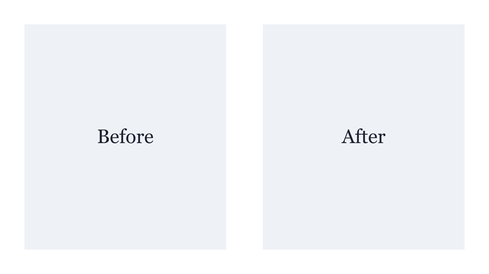

This post is a draft. It is shown by `pnpm dev` and left out of `pnpm build`, and exists only to check how headings, code, images, tables and quotes look. A [link to the Dart site](https://dart.dev/) sits in this paragraph, next to some `inlineCode()`.

A second paragraph checks the space between paragraphs. It is long enough to wrap onto several lines at the full measure, which is the width most text on this site is read at.

## Code

The next block is exactly 80 columns wide, which is the Dart formatter's default line length. Lines longer than the text column scroll horizontally.

```dart
// 3456789012345678901234567890123456789012345678901234567890123456789012345678
Future<void> main() async {
  final shutter = Shutter(output: Directory('build/previews'), scale: 2.0);
  await shutter.capture(); // Renders each @Preview widget to a PNG file.
}
```

### Shell and TypeScript

```bash
# Install dependencies and build the site.
pnpm install --frozen-lockfile
pnpm build
```

```ts
// A comment, to check its contrast.
export function greet(name: string): string {
  return `Hello, ${name}`;
}
```

## Images



*A caption: a paragraph of only italic text right after an image.*

## Tables, quotes and lists

| Package | Purpose | Version |
| --- | --- | --- |
| shutter | Renders previews to PNG | 1.0.0 |
| flutter_actions | Sets up Flutter in GitHub Actions | 2.3.1 |

> Setting up Flutter in GitHub Actions should be straightforward. This quote is from a release note.

- An unordered item
- Another item
  - A nested item

1. The first step
2. The second step

---

The end.
